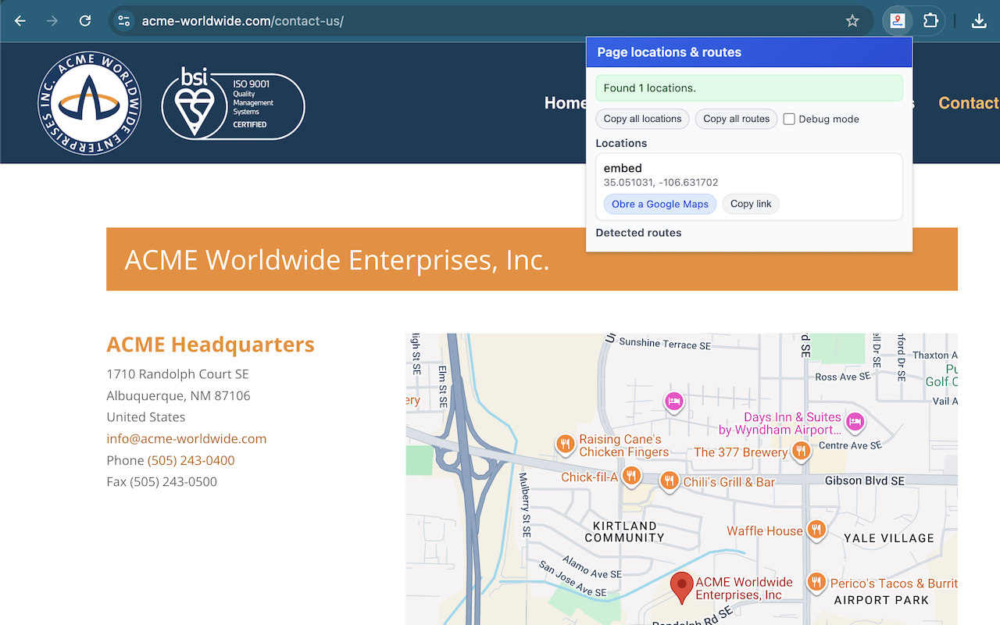
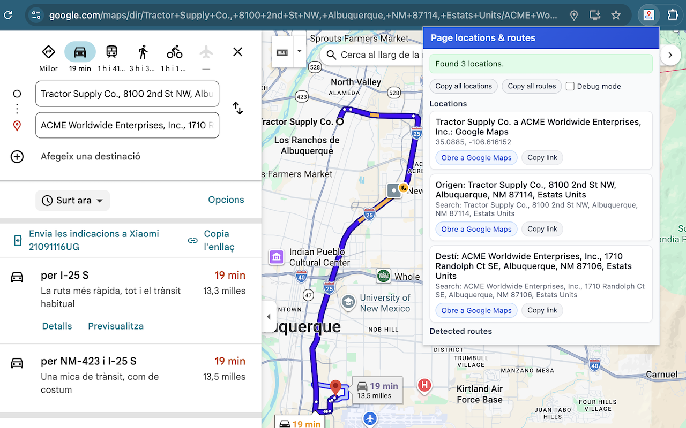

# Map Location & Route Extractor

Tired of embedded maps that you cannot fully interact with?  
This extension lets you **extract real map locations and routes** from any web page and turn them into reusable Google Maps links and downloadable route files.

## Screenshots

## Long description

Map Location & Route Extractor scans the current page and finds:

- Google Maps locations (including Street View and `/maps/dir` routes).
- OpenStreetMap links and embeds.
- Embedded Google Maps iframes (`maps/embed`).
- Raw coordinates written in text (`41.73057, 1.822498`).
- Links to route files (`.gpx`, `.kml`, `.kmz`, `.fit`, `.tcx`).

You get a clean popup with:

- **Locations list**
  - Description and coordinates or search query.
  - Direct link to open the point in Google Maps.
  - Support for points coming from:
    - Google Maps / OpenStreetMap URLs.
    - `schema.org` `geo` metadata.
    - `data-lat` / `data-lng` attributes.
    - Coordinates present only in the page text.

- **Routes list**
  - All detected route download links from the page (GPX/KML/etc.).
  - One-click “Download route” and “Copy link”.

- **Power tools**
  - **Copy all locations**: builds a text list you can paste in notes, tickets or docs.
  - **Copy all routes**: exports all route URLs in one go.
  - **Debug mode**: shows where each location came from (`source`, `id`, `query`), useful when working with complex mapping pages.

Typical use cases:

- Save a Google Maps / OpenStreetMap point from a site that only embeds a locked map.
- Extract the origin and destination of a Google Maps route as independent points.
- Download GPX/KML routes linked from blogs, clubs or event pages.
- Collect all map points from a landing page into your own route-planning tool.

## Privacy policy

This extension is designed with privacy in mind:

- **No tracking, no analytics, no external API calls.**
- All processing happens **entirely in your browser**, on the current page’s DOM.
- The extension **does not send any data to external servers** and does not persistently store any of your browsing data.

Permissions used:

- `activeTab`: needed to read the content of the tab when you click the extension icon. It identifies maps, coordinates and route links on the exact page you are looking at.
- `scripting`: instead of running background content scripts continuously, the extension dynamically injects its parser scripts via the `scripting` API only when you explicitly click the extension action button. This ensures maximum privacy by reading only your intended tab.

If you inspect the source code, you will see that:

- There is no network code other than what the page itself already runs.
- The extension only reads DOM elements and constructs map/route URLs for your convenience.

By installing this extension you agree that it will analyse the current page’s content locally in your browser to extract map-related information, but **no information leaves your device**.

## Author

**David Portabella** 📧 [david.portabella@gmail.com](mailto:david.portabella@gmail.com)

*This project was developed by David Portabella with the assistance of AI generative tools.*
